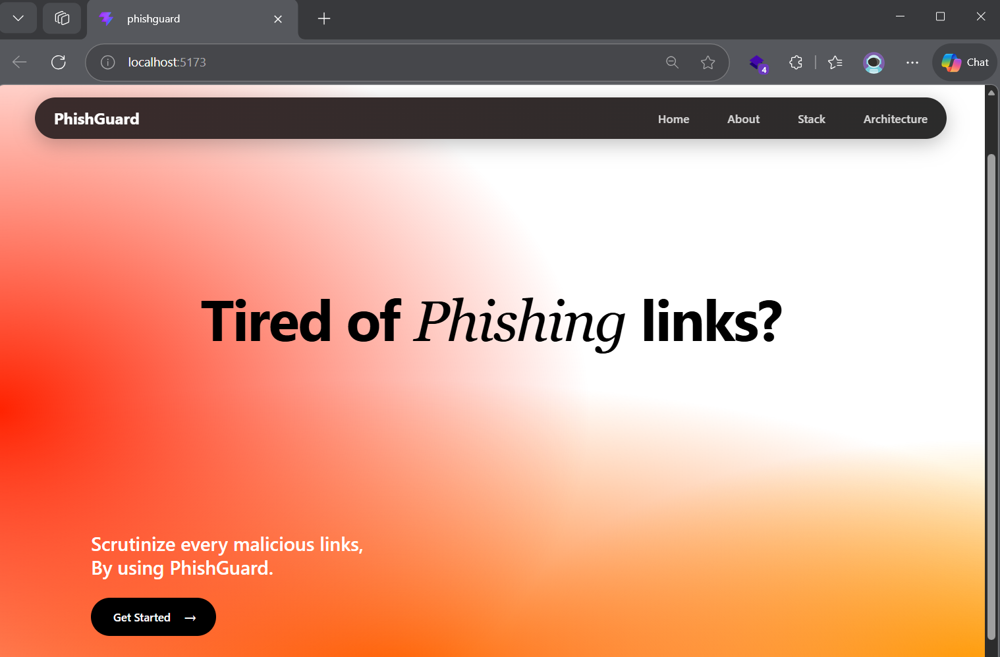
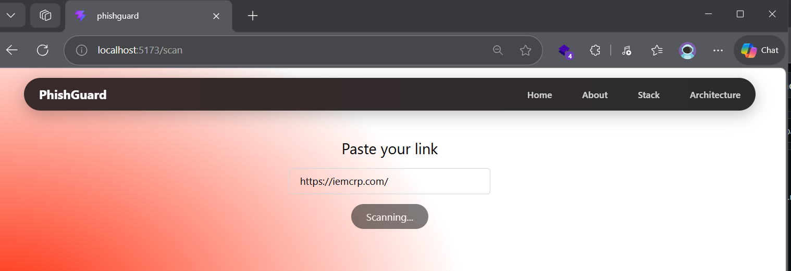
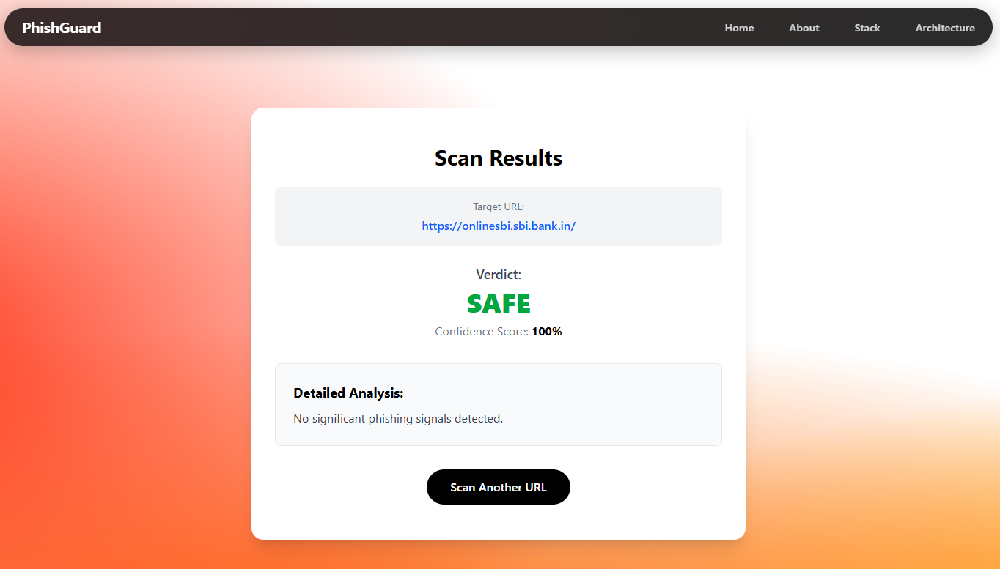

# 🛡️ PhishGuard: Intelligent URL Threat Scanner

## PhishGuard is a modern, full-stack machine learning application designed to detect and prevent phishing attacks. By scrutinizing URL structures, domain age, and security protocols, PhishGuard classifies links as **Safe**, **Suspicious**, or **Phishing** in real-time.

---

## 📸 Application Showcase

Here is a look at PhishGuard in action:

| Home Page | Scanner Interface | Results Dashboard |
| :---: | :---: | :---: |
|  |  |  |

---

## 🛠️ Tech Stack

* **Frontend:** React.js, Vite, Tailwind CSS, React Router
* **Backend:** FastAPI, Uvicorn, Python
* **Machine Learning:** Scikit-Learn (Random Forest Classifier), Joblib
* **Data Extraction:** `tldextract`, `python-whois`, `urllib`

---

## 📁 Project Structure

```text
PhishGuard/
├── artifacts/                        # Generated ML models and metadata
│   ├── model.pkl                     # Trained Random Forest Model
│   └── feature_importance.json       # Feature weight mappings
├── backend/                    
│   └── main.py                       # FastAPI server, CORS, and endpoints
├── FinalOutputsImages/               # Project screenshots for documentation
├── frontend/                         # Vite + React User Interface
│   ├── public/                       # Static public assets
│   │   ├── favicon.svg
│   │   └── icons.svg
│   ├── src/                    
│   │   ├── assets/                   # Local images and SVGs
│   │   ├── components/               
│   │   │   ├── common/               # Reusable wrappers (PageWrapper)
│   │   │   └── navbar/               # Navigation components
│   │   ├── pages/                    # React Router Page Views
│   │   │   ├── About.jsx
│   │   │   ├── Architecture.jsx
│   │   │   ├── GetStarted.jsx        # Scanner input form
│   │   │   ├── Home.jsx              # Landing page
│   │   │   ├── Result.jsx            # ML Data display
│   │   │   └── Stack.jsx
│   │   ├── App.jsx                   # Main routing logic
│   │   ├── main.jsx                  # React DOM entry point
│   │   ├── App.css                   # Component styles
│   │   └── index.css                 # Tailwind directives
│   ├── eslint.config.js              # Linter configuration
│   ├── index.html                    # Frontend entry HTML
│   ├── package.json                  # Node dependencies
│   └── vite.config.js                # Vite build configuration
├── ml_engine/                        # Core Machine Learning Pipeline
│   ├── evaluate.py                   # Performance evaluation script
│   ├── feature_extractor.py          # URL dissection and UCI dataset encoding
│   ├── predict.py                    # Inference engine and explanation builder
│   ├── test_single.py                # Standalone script for testing individual URLs
│   └── train.py                      # Random Forest training script
├── requirements.txt                  # Python dependencies
└── uci-ml-phishing-dataset.csv       # Primary ML training dataset
```
---

---

## 🧠 Architecture & Workflow
PhishGuard operates on a highly responsive 3-tier architecture:

The User Interface (React): Users access the app and paste a suspicious URL into the /scan interface. The React frontend packages this URL into a JSON payload and fires an asynchronous HTTP POST request to the backend.

The API Bridge (FastAPI):
The backend receives the payload at the /api/scan endpoint. It parses the request and passes the raw URL string directly into the local Machine Learning engine.

The ML Engine & Feature Extractor:

Extraction: The engine dissects the URL into 7 specific features (HTTPS presence, URL length, subdomain count, IP presence, '@' symbol, hyphen count, and WHOIS domain age).

Encoding: These raw metrics are mathematically mapped into a categorical format (1, 0, -1) to match the exact shape of the UCI Phishing Dataset.

Prediction: The pre-trained Random Forest model (model.pkl) evaluates the encoded vector, calculates a risk probability score, and generates a dynamic, human-readable explanation of the flagged traits.

Resolution: FastAPI packages the verdict (Label, Confidence Score, Explanation) and sends the JSON response back to React. The UI seamlessly transitions to the Results dashboard to alert the user.

---

## 🚀 Getting Started (Local Setup)
To run this project locally, clone the repository and open three separate terminal windows.

Prerequisites
Node.js (v16+)

Python (3.9+)

Step 1: Execute the ML Pipeline
Before running the application servers, you must execute the machine learning pipeline to prepare the data, train the Random Forest model, and test the inference engine.

Open your first terminal and run:
```bash
# 1. Install all required Python dependencies
pip install -r requirements.txt

# 2. Navigate to the ML engine directory
cd ml_engine

# 3. Execute the pipeline in sequence
python feature_extractor.py
python train.py
python evaluate.py
python predict.py
python test_single.py
```

(Ensure model.pkl is successfully generated in the artifacts/ folder before proceeding).

Step 2: Start the FastAPI Backend
Open a second terminal window to start the Python backend.

```Bash
cd backend
uvicorn main:app --reload --port 8000
The backend API is now running and listening on http://localhost:8000
```

Step 3: Start the React Frontend
Open a third terminal window to boot up the user interface.


```Bash
cd frontend
npm install
npm run dev
```

The frontend is now accessible at the local Vite port (usually http://localhost:5173). Open this link in your browser to start scanning!


## 📡 Core API Endpoint
POST /api/scan
Evaluates a target URL for phishing threats.

Request Body:

```JSON
{
  "url": "[http://example.com/login](http://example.com/login)"
}
```

Response (Success):

```JSON
{
  "label": "suspicious",
  "score": 65,
  "confidence": 35,
  "features": {
    "has_https": -1,
    "url_length": 1,
    "subdomain_count": 1,
    "has_at_symbol": 1,
    "hyphen_count": 1,
    "has_ip_in_url": 1,
    "domain_age_days": 1
  },
  "explanation": "Flagged because: uses HTTP instead of HTTPS."
}
```

---

## 🤝 Contributing
Contributions, issues, and feature requests are always welcome! If you are adding new features to the ML model, ensure the FEATURES array in feature_extractor.py is updated to perfectly match your new dataset schema before initiating the training sequence.
